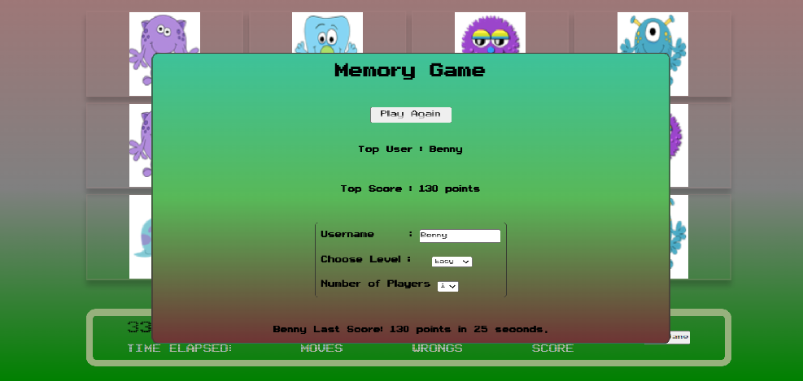

# Memory-Game

In this porject we asked to work in a team of 3 developers to create a "memory-game".
Our Game follow to the specification requierments as describe bellow. ( Minimum and All optional)

## Must do

1. The game must follow the tradionals logic of memory game.
2. Fliping animation by click.
3. Delay for a bit when 2 cards were selected to present the "hidden" card.
4. Responsivness

## Optional

1. Store highe score in browswer (local storage)
2. Reset game.
3. Shuffeling animation.
4. Massage to the user and a pop up window.
5. Sound for actions.
6. Level selected will print different amounts of cards.
7. 2 players

